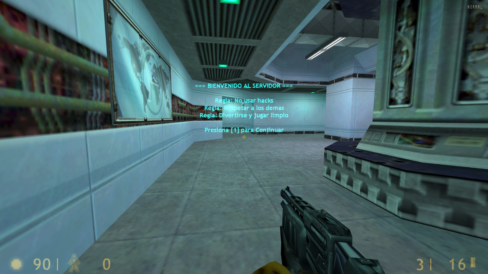

# 🎧 HUB Welcome Music (v1.0)

Este plugin para **AMX Mod X** está diseñado específicamente para servidores de **Half-Life**. Permite recibir a los científicos y guardias con música personalizada y un menú de reglas obligatorio que deben aceptar para limpiar su pantalla antes de la acción. 

## ✨ Características
* **Menú de Bienvenida**: Presenta un menú centrado con las reglas del servidor que el jugador debe aceptar presionando la tecla `1`. 
* **Audio de Entrada**: Al conectar, se ejecuta el comando de sonido para reproducir `bienvenida.wav`. 
* **HUD de Alto Contraste**: Utiliza el canal fijo `4` para mostrar un mensaje en color cian (0, 255, 255) que no interfiere con los mensajes globales del juego.
* **Borrado Seguro**: Al aceptar, el plugin detiene el audio y utiliza un método de sobreescritura para eliminar el mensaje HUD instantáneamente.

---

## 🛠️ Guía de Instalación en Half-Life

Sigue estos pasos para instalar el plugin en tu servidor HLDS:

### 1. Ubicar el Sonido
* Coloca el archivo `bienvenida.wav` en: `valve/sound/misc/`. 

### 2. Instalar el Binario
* Sube el archivo `hub_welcome_music.amxx` a: `valve/addons/amxmodx/plugins/`. 

### 3. Código Fuente (SMA)
* Si deseas modificar las reglas o el canal del HUD, el archivo `hub_welcome_music.sma` va en: `valve/addons/amxmodx/scripting/`. 

### 4. Activación
* Abre el archivo `valve/addons/amxmodx/configs/plugins.ini`.
* Añade esta línea al final del documento:
  ```text
  hub_welcome_music.amxx

